# Tomato Case Agent 架构

本文档描述正式开发前的 Tomato Case Agent 结构。目标是把 Agent 回路显式化：观察用户的病例上下文，决定下一步动作，通过受控工具执行，持久化记忆，并继续推进处置闭环。

## Agent 目标

Tomato Case Agent 的目标是帮助用户将一个番茄异常 Case 从首次上报推进到安全处置、Follow-up、升级或结案。

这个 Agent 不能表现成一次性病虫害聊天机器人。它需要保留 Case Memory，使用 Knowledge Memory，执行 Safety Check，创建 Follow-up，把后续观察和之前的 Case Event 做比较，并维护可回放的 Event Memory。

用户实际体验是聊天和图片上传。`Case` 是系统从 Conversation 中自动创建和维护的内部处置对象，不要求用户手动理解或管理“病例”概念。

## 运行回路

```text
API / UI
  -> CaseOrchestrator
    -> assemble Working Memory
    -> structure symptoms or follow-up input
    -> ask AgentDecisionEngine for next Agent Action, turn intent and response focus
    -> validate with StateMachine and SafetyChecker
    -> execute action tools
    -> persist Case Events and Case Memory
    -> return user-facing response
```

`CaseOrchestrator` 是 Agent runtime。`AgentDecisionEngine` 是决策层，它不只选择下一步动作，也会输出本轮用户意图和回答焦点，避免后续追问被旧病例上下文淹没。完整的 Agent 不是某一个类，而是由运行时、决策、记忆、工具、约束、表达层和持久化共同组成的回路。

## 粗略版流程图

这张图只表达 Agent 的持续运行方式：每次外界出现新观察，系统都会重新进入同一个闭环。一次 1-8 的流程只是一个 Agent turn，不是整个系统结束。

```mermaid
flowchart LR
    Env["环境变化"]:::external
    User["用户输入"]:::actor
    Trigger["触发器"]:::trigger
    Observe["Observe<br/>读取状态、记忆、知识、环境"]:::observe
    Decide["Decide<br/>选择下一步动作"]:::decision
    Guard["Guard<br/>状态、安全、输出约束"]:::guardrail
    Act["Act<br/>调用工具执行动作"]:::tool
    Persist["Persist<br/>写回病例、事件、复查任务"]:::memory
    Respond["Respond<br/>返回建议或创建提醒"]:::runtime
    Wait["Wait<br/>等待新观察"]:::wait

    User --> Trigger
    Env --> Trigger
    Trigger --> Observe --> Decide --> Guard --> Act --> Persist --> Respond --> Wait
    Wait --> Trigger
    Persist --> Observe
    Act --> Trigger

    classDef actor fill:#fff4cc,stroke:#d6a800,color:#3d2c00,stroke-width:2px;
    classDef external fill:#fae8ff,stroke:#c026d3,color:#4a044e,stroke-width:2px;
    classDef trigger fill:#fef9c3,stroke:#ca8a04,color:#422006,stroke-width:2px;
    classDef observe fill:#dbeafe,stroke:#2563eb,color:#082f49,stroke-width:2px;
    classDef decision fill:#ffe4e6,stroke:#e11d48,color:#4c0519,stroke-width:2px;
    classDef guardrail fill:#dcfce7,stroke:#16a34a,color:#052e16,stroke-width:2px;
    classDef tool fill:#fef3c7,stroke:#f59e0b,color:#451a03,stroke-width:2px;
    classDef memory fill:#ccfbf1,stroke:#0f766e,color:#042f2e,stroke-width:2px;
    classDef runtime fill:#ede9fe,stroke:#7c3aed,color:#2e1065,stroke-width:2px;
    classDef wait fill:#f5f5f4,stroke:#78716c,color:#292524,stroke-width:2px;
```



可触发新一轮 Agent turn 的观察包括：

- 用户补充症状、回答追问、提交复查、上传图片或要求结案。
- 到达 Follow-up 到期时间，系统需要提醒或重新评估。
- 天气、湿度、温度或温室环境发生重要变化。
- 图片分析结果、知识导入结果或人工确认结果返回。
- SafetyChecker、StateMachine 或 OutputPolicy 阻断某个动作后，需要重新选择安全动作。

因此，Agent 的“自主”不是一次流程跑完就结束，而是每次观察变化都会读取最新 Case Memory、Event Memory、Knowledge Memory 和环境上下文，重新选择下一步动作。

Follow-up 在 MVP 阶段可以只是系统内的复查计划；完整版中它应该成为可调整的 Follow-up Schedule，可以同步到用户日历、提醒或待办，并在用户提前反馈、症状恶化、环境变化或安全策略变化时重新安排。

## 详细执行图

```mermaid
flowchart TB
    User["用户"]:::actor
    UI["API / UI"]:::entrypoint

    Orchestrator["CaseOrchestrator"]:::runtime
    ActionExecutor["ActionExecutor"]:::runtime
    ResponseBuilder["ResponseBuilder"]:::runtime

    Step1["1 读取持久化记忆"]:::step
    Step2["2 解析用户输入"]:::step
    Step3["3 组装 Working Memory"]:::step
    Step4["4 Agent 决策"]:::step
    Step5["5 确定性约束"]:::step
    Step6["6 执行动作工具"]:::step
    Step7["7 写回记忆"]:::step
    Step8["8 构造响应"]:::step
    TriggerAgain["等待或触发下一轮"]:::step

    subgraph MemoryLayer["Durable Memory 持久化记忆"]
        CaseMemory["Case Memory"]:::memory
        EventMemory["Event Memory"]:::memory
        FollowupMemory["Follow-up Memory"]:::memory
        KnowledgeMemory["Knowledge Memory"]:::memory
        UserProfile["User Profile 后续"]:::future
        EnvMemory["Environment Memory"]:::memory
        ImageMemory["Image Evidence Memory"]:::memory
        ProvenanceMemory["Knowledge Provenance Memory 后续"]:::future
    end

    subgraph PerceptionLayer["Perception 感知与解析"]
        TriggerEvent["TriggerEvent<br/>用户、复查、提醒、天气、图片、人工反馈"]:::trigger
        SymptomTool["SymptomExtractionTool"]:::tool
        FollowupParseTool["FollowupParseTool"]:::tool
        VisionTool["VisionTool"]:::tool
        WeatherTool["WeatherTool"]:::tool
    end

    WorkingMemory["Working Memory"]:::working

    subgraph DecisionLayer["Decision 决策"]
        DecisionEngine["AgentDecisionEngine"]:::decision
        ActionContract["Agent Action Contract"]:::decision
    end

    subgraph GuardrailLayer["Guardrails 确定性约束"]
        StateMachine["StateMachine"]:::guardrail
        SafetyChecker["SafetyChecker"]:::guardrail
        OutputPolicy["OutputPolicy"]:::guardrail
        SourcePolicy["SourcePolicy 后续"]:::future
        RegionPolicy["RegionPolicy 后续"]:::future
    end

    subgraph ToolLayer["Tool Interfaces 工具接口"]
        KnowledgeTool["KnowledgeSearchTool"]:::tool
        DiagnosisTool["DiagnosisTool"]:::tool
        PlanTool["PlanTool"]:::tool
        FollowupTool["FollowupTool"]:::tool
        CompareTool["FollowupCompareTool"]:::tool
        ImportTool["KnowledgeImportTool 后续"]:::future
        CurationTool["KnowledgeCurationTool 后续"]:::future
        CalendarReminderTool["CalendarReminderTool"]:::tool
        DateTool["DateTool"]:::tool
        ResponseComposer["ResponseComposer"]:::tool
        ReportTool["ReportTool 后续"]:::future
        HumanSummaryTool["HumanSummaryTool 后续"]:::future
        AuditTool["AuditTool 后续"]:::future
    end

    subgraph AdapterLayer["Tool Adapters 工具适配器"]
        SQLiteAdapter["SQLiteAdapter"]:::adapter
        MarkdownAdapter["MarkdownKnowledgeAdapter"]:::adapter
        LLMAdapter["LLMAdapter"]:::adapter
        WeatherAdapter["WeatherAdapter 后续"]:::future
        VisionAdapter["VisionAdapter 后续"]:::future
        DocumentAdapter["DocumentParserAdapter 后续"]:::future
        VectorAdapter["VectorSearchAdapter 后续"]:::future
        NotificationAdapter["NotificationAdapter 后续"]:::future
        ExportAdapter["ExportAdapter 后续"]:::future
    end

    subgraph ResourceLayer["External Resources 外部资源"]
        SQLite["SQLite"]:::storage
        Markdown["Markdown Knowledge"]:::storage
        LLM["LLM API"]:::external
        WeatherAPI["Weather API 后续"]:::future
        VisionModel["Multimodal Model 后续"]:::future
        WordPDF["Word PDF Web 后续"]:::future
        VectorDB["Vector BM25 Index 后续"]:::future
        NotificationProvider["通知渠道 后续"]:::future
        FileStorage["文件存储 后续"]:::future
    end

    User --> UI --> Orchestrator
    TriggerEvent --> Orchestrator
    Orchestrator --> Step1
    Step1 --> CaseMemory
    Step1 --> EventMemory
    Step1 --> FollowupMemory
    Orchestrator --> Step2 --> SymptomTool
    Step2 --> FollowupParseTool
    CaseMemory --> Step3
    EventMemory --> Step3
    FollowupMemory --> Step3
    KnowledgeMemory --> Step3
    SymptomTool --> Step3
    FollowupParseTool --> Step3
    Step3 --> WorkingMemory
    WorkingMemory --> Step4 --> DecisionEngine --> ActionContract
    ActionContract --> Orchestrator
    Orchestrator --> Step5 --> StateMachine
    Step5 --> SafetyChecker
    StateMachine --> Orchestrator
    SafetyChecker --> Orchestrator
    Orchestrator --> Step6 --> ActionExecutor
    ActionExecutor --> KnowledgeTool
    ActionExecutor --> DiagnosisTool
    ActionExecutor --> PlanTool
    ActionExecutor --> FollowupTool
    ActionExecutor --> CompareTool
    KnowledgeTool --> MarkdownAdapter
    MarkdownAdapter --> Markdown
    DiagnosisTool --> LLMAdapter
    PlanTool --> LLMAdapter
    CompareTool --> LLMAdapter
    FollowupTool --> SQLiteAdapter
    SQLiteAdapter --> SQLite
    Orchestrator --> Step7 --> CaseMemory
    Step7 --> EventMemory
    Step7 --> FollowupMemory
    Orchestrator --> Step8 --> ResponseBuilder --> UI --> User
    ResponseBuilder --> TriggerAgain
    TriggerAgain --> TriggerEvent
    Step7 --> TriggerAgain

    SymptomTool --> LLMAdapter
    FollowupParseTool --> LLMAdapter
    DecisionEngine --> LLMAdapter
    CaseMemory --> SQLiteAdapter
    EventMemory --> SQLiteAdapter
    FollowupMemory --> SQLiteAdapter
    KnowledgeMemory --> MarkdownAdapter
    SafetyChecker --> OutputPolicy
    StateMachine --> Orchestrator

    WeatherTool -.-> WeatherAdapter
    VisionTool -.-> VisionAdapter
    ImportTool -.-> DocumentAdapter
    KnowledgeTool -.-> VectorAdapter
    CalendarReminderTool -.-> NotificationAdapter
    DateTool --> Orchestrator
    ResponseComposer --> LLMAdapter
    ReportTool -.-> ExportAdapter
    HumanSummaryTool -.-> LLMAdapter
    CurationTool -.-> KnowledgeMemory
    AuditTool -.-> EventMemory

    LLMAdapter --> LLM
    WeatherAdapter -.-> WeatherAPI
    VisionAdapter -.-> VisionModel
    DocumentAdapter -.-> WordPDF
    VectorAdapter -.-> VectorDB
    NotificationAdapter -.-> NotificationProvider
    ExportAdapter -.-> FileStorage

    classDef actor fill:#fff4cc,stroke:#d6a800,color:#3d2c00,stroke-width:2px;
    classDef entrypoint fill:#e8f4ff,stroke:#3b82f6,color:#0f2f57,stroke-width:2px;
    classDef runtime fill:#ede9fe,stroke:#7c3aed,color:#2e1065,stroke-width:2px;
    classDef step fill:#ffffff,stroke:#111827,color:#111827,stroke-width:2px;
    classDef trigger fill:#fef9c3,stroke:#ca8a04,color:#422006,stroke-width:2px;
    classDef decision fill:#ffe4e6,stroke:#e11d48,color:#4c0519,stroke-width:2px;
    classDef guardrail fill:#dcfce7,stroke:#16a34a,color:#052e16,stroke-width:2px;
    classDef tool fill:#fef3c7,stroke:#f59e0b,color:#451a03,stroke-width:2px;
    classDef memory fill:#dbeafe,stroke:#2563eb,color:#082f49,stroke-width:2px;
    classDef working fill:#ccfbf1,stroke:#0f766e,color:#042f2e,stroke-width:3px;
    classDef adapter fill:#e0f2fe,stroke:#0284c7,color:#082f49,stroke-width:2px;
    classDef storage fill:#f3f4f6,stroke:#6b7280,color:#111827,stroke-width:2px;
    classDef external fill:#fae8ff,stroke:#c026d3,color:#4a044e,stroke-width:2px;
    classDef future fill:#f5f5f4,stroke:#a8a29e,color:#44403c,stroke-dasharray:5 5;
```



图中约定：

- `Durable Memory` 是 Agent 推理前要读取、动作执行后要写回的持久化上下文层，不属于普通工具集合。
- `Working Memory` 是当前轮次临时组装出来的推理上下文，来自用户输入、持久化记忆、解析结果、检索知识和安全上下文。
- `Tool Interface` 是动作执行阶段调用的稳定能力接口；它们可能读取或写入记忆，但不等同于记忆本身。
- `Tool Adapter` 是 Tool 或 Memory 背后连接数据库、文件、模型或外部 API 的适配器。
- `External Resource` 是真实资源，例如 SQLite、Markdown 文件、LLM API、天气 API、视觉模型、Word/PDF 资料。
- `StateMachine`、`SafetyChecker` 和 `OutputPolicy` 是强制约束，不由模型自由决定是否调用。
- 后续能力用虚线样式表示，说明它们属于最终目标的一部分，但不进入 MVP 第一阶段。

## 主要模块

### CaseOrchestrator

接口：

```python
create_case(input: CreateCaseInput) -> CaseResponse
reply_to_case(case_id: int, message: str) -> CaseResponse
submit_followup(case_id: int, input: FollowupInput) -> CaseResponse
close_case(case_id: int, summary: str) -> CaseResponse
```

职责：

- 加载 Case Memory 和 Event Memory。
- 为当前轮次构建 Working Memory。
- 按正确顺序调用症状提取、决策、知识、安全、状态、复查和事件模块。
- 只有在约束模块通过后才执行 Agent Action。
- 将有意义的决策和输出持久化为 Case Event。

它应该把大部分流程复杂度隐藏在 API handler 之后。

### AgentDecisionEngine

接口：

```python
decide(context: AgentDecisionContext) -> AgentDecision
```

MVP Agent Action：

```text
ASK_MORE_INFO
DIAGNOSE_AND_PLAN
COMPARE_FOLLOWUP
ESCALATE
CLOSE_CASE
```

职责：

- 读取 Working Memory，并选择下一步 Agent Action。
- 返回结构化意图，而不是直接产生最终副作用。
- 解释为什么选择该动作。
- 严格限定在给定动作集合内。

它不能写数据库，不能最终确定 Case Status，也不能绕过 Safety Check。

### StateMachine

接口：

```python
transition(current: CaseStatus, requested: CaseStatus, reason: str) -> TransitionResult
```

职责：

- 验证 Case Status 流转是否合法。
- 拒绝非法流转，例如随意更新已结案 Case。
- 保持生命周期规则确定、可测试，并且不依赖 LLM。

### SafetyChecker

接口：

```python
check(context: SafetyContext) -> SafetyResult
```

职责：

- 执行采收时间、近期用药、不确定性、严重程度和种植环境规则。
- 在 MVP 阶段阻断具体农药名称、剂量、兑水比例、施药频次和混配建议。
- 当风险过高、不适合保守自助处置时强制升级。

Safety Check 是约束模块，不是可选工具。

### KnowledgeBase

接口：

```python
search(symptoms: StructuredSymptoms) -> list[KnowledgeEntry]
get(problem_name: str) -> KnowledgeEntry
```

职责：

- 提供经过整理的番茄问题知识。
- 返回结构化 Knowledge Entry，而不是原始文档切块。
- MVP 从 Markdown 条目和关键词/类别匹配开始。
- 后续允许通过整理流程从 Word/PDF 资料导入知识。

### EventLog

接口：

```python
append(case_id: int, event: CaseEventInput) -> CaseEvent
list_for_case(case_id: int) -> list[CaseEvent]
```

职责：

- 保存可回放的 Case 时间线。
- 存储用户输入、Agent Decision、Safety Check、Handling Plan、Follow-up、状态变化、升级和结案。
- 支持复查比较和问题排查。

### FollowupManager

接口：

```python
create_from_plan(case_id: int, plan: HandlingPlan) -> Followup
submit(case_id: int, input: FollowupInput) -> Followup
active_for_case(case_id: int) -> Followup | None
```

职责：

- 根据 Handling Plan 创建 Follow-up。
- 保存复查清单和复查日期。
- 向 Working Memory 提供当前 Follow-up 上下文。

## 记忆模型

```text
Working Memory
  仅存在于当前轮次：最新输入、状态、当前 follow-up、结构化症状、
  检索到的知识、安全上下文和决策上下文。

Case Memory
  持久化的当前 Case 摘要：状态、疑似问题、当前方案、
  结构化字段和当前 follow-up 引用。

Event Memory
  完整有序的 Case Event，用于回放、比较和解释。

Knowledge Memory
  诊断和生成方案时使用的番茄 Knowledge Entry。

User Profile
  推迟到 MVP 之后。首版使用每个 Case 内的字段即可。
```

系统不应该把通用的“最近 10 轮消息”作为主要记忆。复查比较应该使用相关 Case Event 和当前 Follow-up 上下文。

## 当前架构修正原则

最近一轮优化确认了两个真实架构问题：

- 旧问题一：回答生成只拿完整病例结果，不知道本轮用户是在问“能不能用药”还是“用什么药”，导致后续追问不断重复首次诊断。
- 旧问题二：日期、天气和提醒有代码，但没有作为正式工具进入 Agent trace 和 Working Memory，容易让系统看起来像普通后端流程。

当前修正：

- `AgentDecisionEngine` 输出 `user_intent` 和 `response_focus`。动作仍然是有限白名单，但回答层会按本轮焦点组织语言。
- `ResponseComposer` 只负责表达，不允许修改诊断、处理建议、采收安全、复查安排和用药边界。
- `DateTool`、`WeatherTool`、`CalendarReminderTool` 进入正式工具层和事件记录；后续可继续接 MCP 或外部 API。
- 旧病例事实会保留给诊断工具使用，但回答内容不会被旧上下文压过。也就是说，记忆用于判断，不应该让每一轮回复都像重新开诊断报告。

## 动作执行路径

### ASK_MORE_INFO

```text
AgentDecisionEngine -> ASK_MORE_INFO
StateMachine -> NEED_MORE_INFO allowed
EventLog -> QUESTIONS_ASKED, STATE_CHANGED
Response -> targeted questions
```

### DIAGNOSE_AND_PLAN

```text
Structure symptoms
KnowledgeBase.search
SafetyChecker.check
AgentDecisionEngine -> DIAGNOSE_AND_PLAN
Generate suspected diagnosis and Handling Plan
FollowupManager.create_from_plan
StateMachine -> FOLLOWUP_PENDING
EventLog -> DIAGNOSIS_GENERATED, SAFETY_CHECKED, PLAN_GENERATED, FOLLOWUP_CREATED, STATE_CHANGED
Response -> diagnosis, plan, safety warnings, follow-up checklist
```

### COMPARE_FOLLOWUP

```text
FollowupManager.submit
Load relevant Event Memory
Compare previous symptoms/plan/checklist with current input
SafetyChecker.check if worsening or high risk
StateMachine -> IMPROVING, WORSENING, ESCALATED, or NEED_MORE_INFO
EventLog -> FOLLOWUP_SUBMITTED, FOLLOWUP_COMPARED, STATE_CHANGED
Response -> trend and next step
```

### ESCALATE

```text
SafetyChecker or AgentDecisionEngine requests escalation
StateMachine -> ESCALATED if legal
EventLog -> ESCALATED, STATE_CHANGED
Response -> Human Confirmation recommendation
```

### CLOSE_CASE

```text
Validate closure conditions
StateMachine -> CLOSED if legal
EventLog -> CASE_CLOSED, STATE_CHANGED
Response -> closure summary
```

## MVP 技术形态

```text
Backend: Python + FastAPI
Frontend: Vite + React + TypeScript + Ant Design + React Flow
Persistence: PostgreSQL via SQLAlchemy + psycopg + Alembic
Schemas: Pydantic
Knowledge Memory: 结构化 Markdown 文件
LLM use: VisionTool 已通过 OpenAI Responses API 生成结构化视觉观察，并进入多模态融合；AgentDecisionEngine 可使用 LLM 输出受控 JSON 决策，后端继续用 Action 白名单、StateMachine、SafetyChecker 和输出策略约束它。规则决策主要作为测试基线和不可用环境下的开发模式，不再作为产品体验目标
Tool protocol: DateTool、WeatherTool、CalendarReminderTool 等工具通过 ToolRegistry 统一描述和调用；`backend/app/mcp_server.py` 提供可选 MCP server 入口，后续可把这些能力暴露给 MCP Host 或接外部 MCP 工具
Deterministic code: 状态流转、安全策略、持久化、复查日期
```

如果运行回路复杂到值得引入框架，后续可以加入 LangChain 或 LangGraph。MVP 应先证明病例处置闭环本身成立。

## MVP 与完整版能力清单

这份清单用于防止后续开发只实现 MVP 后就忘记最终 Agent 形态。MVP 只做能证明病例闭环成立的最小集合；完整版是在不破坏核心架构的前提下扩展感知、记忆、知识、工具和约束。

### Agent Core

MVP：

- `CaseOrchestrator`：病例处置运行时入口。
- `AgentDecisionEngine`：从有限动作集合中选择下一步。
- `ActionContract`：`ASK_MORE_INFO`、`DIAGNOSE_AND_PLAN`、`COMPARE_FOLLOWUP`、`ESCALATE`、`CLOSE_CASE`。
- `Working Memory`：当前轮次上下文。
- `Case Memory`：当前 Case 摘要。
- `Event Memory`：完整 Case Event 时间线。
- `Knowledge Memory`：结构化番茄 Knowledge Entry。

完整版：

- 多阶段决策：支持 `REVISE_PLAN`、`REQUEST_IMAGE`、`REQUEST_ENVIRONMENT_DATA`、`GENERATE_REPORT`、`SCHEDULE_REMINDER`、`REOPEN_OR_CREATE_CASE` 等动作。
- Case summary 压缩：长病例自动生成可追溯摘要，避免上下文过长。
- 跨病例推理：从用户历史 Case 中识别反复出现的环境问题，但不能覆盖当前 Case 事实。
- 多作物上下文：番茄稳定后扩展到黄瓜、辣椒、草莓等作物。

### Tool Interfaces

MVP：

- `SymptomExtractionTool`：把用户自然语言转成结构化症状。
- `KnowledgeSearchTool`：检索结构化番茄知识。
- `DiagnosisTool`：生成疑似诊断和判断依据。
- `PlanTool`：生成受安全约束的 Handling Plan。
- `FollowupTool`：创建和提交 Follow-up。
- `FollowupCompareTool`：比较复查趋势。
- `CaseMemoryTool`：读取和更新 Case。
- `EventMemoryTool`：追加和查询 Case Event。
- `SafetyCheckTool`：强制安全检查。
- `StateTransitionTool`：强制状态流转验证。
- `VisionTool`：接收图片并生成结构化视觉观察；配置 OpenAI Key 后调用多模态模型，未配置时返回降级观察。输出进入 `vision_observation` 和 `multimodal_observation`，再参与 Agent 决策、知识检索和诊断证据。
- `DateTool`：每轮读取当前日期和时间，进入 Working Memory，用于复查到期、采收安全和提醒调整。
- `WeatherTool`：优先使用浏览器定位调用 Open-Meteo 免 Key 天气接口，获取实时温度、湿度、降水和风速；未获定位或接口失败时降级为从用户描述中抽取天气、湿度、温度和通风风险信号。天气风险会进入 SafetyChecker、PlanTool 和用户可见回复。
- `CalendarReminderTool`：系统内复查提醒，创建 Follow-up 时生成，方案变化时重排，提交复查时取消；同时生成 Google Calendar 添加链接和 ICS 下载链接。网页端不能在无授权情况下静默写入用户设备日历；若后续需要自动写入 Google/Microsoft 日历，需要增加对应 OAuth scope 和 Calendar API。
- `ResponseComposer`：把结构化诊断/方案改写为用户可读回复。它必须遵守 SafetyChecker 的边界，且根据 AgentDecisionEngine 输出的 `user_intent` 和 `response_focus` 聚焦本轮问题，避免每轮重复首次诊断。
- `ToolRegistry`：统一注册、描述和调用内部工具，保持 MCP 化边界。
- `MCP Server`：可选入口，当前暴露日期和天气观察工具；后续可继续暴露日历、知识检索或外部 MCP 工具。
- `AuthTool`：JWT 登录态和病例归属过滤。

完整版：

- `VisionTool` 增强：当前已稳定结构化输出叶片、虫体、果实异常线索，并保留置信度与不确定性；后续重点是扩大图像质量检查、部位标准化、病虫害候选映射和人工确认反馈。
- `WeatherTool` 增强：获取真实天气、降雨、湿度、温度等环境上下文。
- `EnvironmentSensorTool`：接入温室传感器或手动环境记录。
- `KnowledgeImportTool`：从 Word/PDF/网页资料导入知识候选。
- `KnowledgeCurationTool`：把原始资料整理成可控 Knowledge Entry。
- `CalendarAdapter`/`NotificationAdapter`：同步日历、提醒和待办。
- `ReportTool`：导出病例报告。
- `HumanSummaryTool`：生成给农技人员阅读的人工确认摘要。
- `UserProfileTool`：维护跨病例用户种植档案。
- `LocalizationTool`：根据地区、季节、登记标签差异调整安全提醒。
- `AuditTool`：回放 Agent Decision、工具调用、安全检查和状态流转。

### Guardrails

MVP：

- `StateMachine`：验证 Case Status 流转。
- `SafetyChecker`：采收、近期用药、不确定性、严重程度和种植环境规则。
- `OutputPolicy`：阻断具体农药名称、剂量、兑水比例、施药频次和混配建议。

完整版：

- 来源约束：用户可见诊断和建议必须能追溯到 Knowledge Entry 或 Case Event。
- 地区约束：涉及用药时提示核对当地登记标签和安全间隔期。
- 严重程度约束：快速扩展、多株同时受害、果实严重受害时强制升级。
- 图片不确定性约束：图片识别只能作为辅助线索，不能绕过文本追问和安全检查。
- 知识质量约束：未审核资料不能直接进入运行时 Knowledge Memory。
- 用户画像约束：User Profile 只能提供背景，不能改写当前 Case 的明确事实。

### Memory

MVP：

- `Working Memory`：当前轮次临时上下文。
- `Case Memory`：当前病例摘要。
- `Event Memory`：完整事件时间线。
- `Knowledge Memory`：结构化 Markdown 知识。

完整版：

- `User Profile`：用户种植环境、常见问题、偏好和地区。
- `Case Summary Memory`：长病例摘要和关键节点压缩。
- `Image Evidence Memory`：图片、图片分析结果和用户确认记录。
- `Environment Memory`：天气、湿度、温度、浇水、施肥和用药历史。
- `Knowledge Provenance Memory`：知识条目的来源、版本和审核状态。

### Tool Adapters / External Resources

MVP：

- `SQLiteAdapter` -> SQLite。
- `MarkdownKnowledgeAdapter` -> Markdown Knowledge。
- `LLMAdapter` -> LLM API。

完整版：

- `VectorSearchAdapter` -> 向量库或混合检索引擎。
- `DocumentParserAdapter` -> Word/PDF/网页资料。
- `VisionAdapter` -> 图片/多模态模型。
- `WeatherAdapter` -> 天气或环境 API。
- `SensorAdapter` -> 温室传感器或环境记录。
- `NotificationAdapter` -> 邮件、短信、微信、小程序或系统提醒。
- `ExportAdapter` -> PDF/Markdown/Word 报告。
- `FileStorageAdapter` -> 图片和报告文件存储。

## 最终目标架构

MVP 的目标是证明“病例处置闭环”成立；最终目标不是把系统堆成更复杂的聊天机器人，而是把 Tomato Case Agent 演进成一个面向小规模番茄种植的持续处置系统。

最终目标应包含以下能力：

- 多模态感知：当前已具备真实 OpenAI 视觉调用边界和结构化输出，视觉观察会与文本症状融合后进入 CaseOrchestrator，由 SafetyChecker 和 StateMachine 约束。后续继续增强图像质量判断、部位标准化和人工确认反馈。
- 知识来源治理：支持从 Word/PDF/网页资料导入知识，但运行时仍使用经过整理、可追溯的 Knowledge Entry，而不是直接裸 RAG。
- 混合检索：在结构化 Markdown 的基础上增加 BM25/向量检索，并保留来源引用和安全过滤。
- 跨病例记忆：基于已结案 Case 形成用户种植档案和常见问题摘要，但不让 User Profile 覆盖当前 Case 的事实。
- 环境上下文：当前已解析用户描述的阴雨、高湿等信号；后续接入天气、湿度、温度或温室环境数据，用于辅助判断高湿、低温、高温和快速扩展风险。
- 复查提醒：当前已有系统内提醒；后续扩展为日历、外部通知和待办同步。
- 报告导出：支持导出 Case 全过程，包括初始症状、诊断依据、处置方案、复查趋势、安全提醒和结案总结。
- 人工确认通道：当系统升级到 Human Confirmation 时，生成给农技人员阅读的结构化摘要。
- 多作物扩展：在番茄闭环稳定后，再扩展黄瓜、辣椒、草莓等作物；扩展时新增 Knowledge Entry 和规则，而不是复制一套 Agent。

最终架构里的核心不变：

```text
Agent 负责选择下一步动作
确定性模块负责状态、安全和持久化
知识库提供可追溯的领域知识
事件日志保留完整病例记忆
复查机制把一次咨询变成持续处置闭环
```

也就是说，长期演进不是让 Agent 更自由，而是让它拥有更好的感知、更可靠的知识、更完整的记忆和更严格的约束。

当前 MVP 已经允许用户在 Conversation 中附加图片，并通过 `VisionTool` 写入 `Image Evidence Memory`、`VISION_ANALYZED` 事件和结构化观察。配置 OpenAI API Key 后，图片会被多模态模型解析为发生部位、可见症状、候选问题、严重程度线索、不确定点和建议追问；`CaseOrchestrator` 会把它与用户文字融合为 `multimodal_observation`，再交给决策器、知识检索和诊断工具。未配置 OpenAI API Key 时，工具会返回未配置观察，主流程仍可验证。无论哪种情况，图片分析结果都只能作为新的观察进入 CaseOrchestrator，不能绕过状态机、安全检查和事件记忆。
