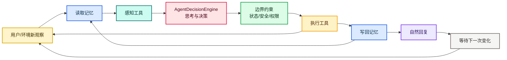
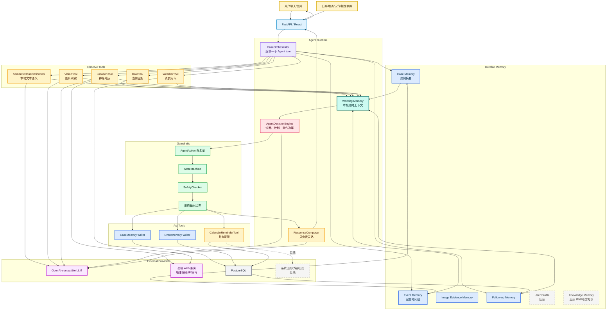

# Tomato Case Agent 架构

本文档记录当前项目的 Agent 架构。核心原则是：大模型负责语义理解、观察综合、诊断推理和下一步决策；后端负责边界、状态、工具、记忆、审计和安全。

## 初心

这个项目不是“为了 Agent 而 Agent”。番茄病虫害处置天然适合 Agent，因为它不是一次性问答，而是一个持续变化的闭环：

- 用户只通过聊天和图片表达问题，系统自动创建和维护内部病例。
- Agent 每轮都要读取病例记忆、事件记忆、图片观察、日期、地点、天气和复查任务。
- Agent 要判断信息够不够、像病害/虫害/缺素/肥害/环境问题中的哪类、严重程度、是否适合处理或用药、什么时候复查、复查后如何调整。
- 工具调用、状态变化、提醒创建和事件记录都必须可追踪。
- 用户后续补充、纠正、提前反馈、天气变化、复查到期，都可以触发下一轮决策。

## 粗略流程图

## 真实运行循环

## 模块定位

`CaseOrchestrator` 是 Agent 运行时，不是“大脑”。它负责按顺序组织一轮循环：读取记忆、调用感知工具、组装 Working Memory、调用决策器、执行边界检查、调用行动工具、写回记忆、生成回复。

`AgentDecisionEngine` 是 Agent 的思考和决策核心。它综合本轮用户输入、语义观察、视觉观察、地点、天气、日期、复查任务和历史摘要，直接输出诊断判断、处置计划、复查安排、用户意图、回答焦点和下一步动作。

`SemanticObservationTool` 只理解用户本轮文本和病例文字记忆，判断用户意图、是否复查、复查趋势、用户纠正和症状语义。它不负责地点、天气、图片阶段或最终诊断。

`LocationTool` 只负责地点。优先让 LLM 判断用户本轮是否明确给出实际种植地点；如果有，就用高德地理编码；如果没有，再用客户端坐标或高德 IP 定位兜底，并要求用户确认。

`WeatherTool` 只负责查真实天气。它根据 LocationTool 的 adcode 调高德天气 API，不再从用户文字中抽取“阴雨/高湿”等语义。用户说的天气事实由 SemanticObservationTool 放入上下文，交给 AgentDecisionEngine 综合。

`VisionTool` 只负责图片观察。它输出发生部位、可见症状、候选问题、生长阶段提示、采收接近程度提示和不确定点，不直接做最终诊断。

`SafetyChecker`、`StateMachine`、`ActionWhitelist` 和 `OutputPolicy` 是硬边界。它们不是为了替代大模型理解，而是防止越权动作、不合法状态流转和危险用药输出。

`ResponseComposer` 只负责把结构化结果说成人话。它不能新增诊断、事实、药名、剂量、兑水比例、施药频次或改变复查安排。

## 当前工具状态

已接入主循环：

- `DateTool`
- `SemanticObservationTool`
- `VisionTool`
- `LocationTool`
- `WeatherTool`
- `SafetyChecker`
- `CalendarReminderTool`
- `ResponseComposer`
- Case/Event/Follow-up Memory 写入

已从主循环移除：

- `SymptomExtractionTool`
- `DiagnosisTool`
- `PlanTool`
- `FollowupCompareTool`

暂时保留但不参与常规诊断：

- `KnowledgeSearchTool`

知识库后续更适合用于大模型不一定掌握、且需要本地化/可追溯的内容，例如 IPM 综合防治策略、地方农技站资料、采前安全间隔提示、温室管理规范、品种/季节/地区相关经验，而不是用普通番茄病虫害百科限制模型。

## Action Contract

当前 Agent 动作白名单：

- `ASK_MORE_INFO`：信息不足，追问关键事实。
- `DIAGNOSE_AND_PLAN`：综合判断、给出处置和复查计划。
- `COMPARE_FOLLOWUP`：用户本轮明确是在描述后续变化，比较趋势并调整状态。
- `ESCALATE`：风险高或模型/边界无法安全推进，升级人工确认。
- `CLOSE_CASE`：仅用户明确要求停止跟踪时使用。

动作来自模型判断，但执行必须经过白名单、状态机和安全检查。

## 完整运行路径

1. 用户发送文字或图片，前端立即显示本轮消息和左侧会话占位。
2. 后端自动创建或读取内部 Case。
3. `DateTool` 获取当前日期。
4. `VisionTool` 分析图片，如果没有图片则跳过。
5. `SemanticObservationTool` 理解本轮文本语义。
6. `LocationTool` 解析或推断实际种植地点。
7. `WeatherTool` 根据地点查询真实天气。
8. `CaseOrchestrator` 读取 Case/Event/Follow-up Memory，组装 Working Memory。
9. `AgentDecisionEngine` 输出本轮诊断、计划、动作、复查、用户意图和回答焦点。
10. `StateMachine`、`SafetyChecker`、输出边界执行确定性检查。
11. 如果需要，`CalendarReminderTool` 创建或调整复查提醒。
12. Case Memory、Event Memory、Follow-up Memory 写回 PostgreSQL。
13. `ResponseComposer` 把结构化结果改写成自然回复。
14. 前端展示回复、状态机高亮、工具调用和事件时间线。
15. 等待用户补充、天气变化、提醒到期或人工反馈，进入下一轮。

## 技术栈

- Backend：FastAPI、SQLAlchemy、Pydantic、PostgreSQL。
- Frontend：Vite、React、TypeScript、Ant Design、React Flow。
- LLM：OpenAI-compatible Responses API。
- 地点/天气：高德 Web 服务。
- 日历：当前为系统内复查提醒和 ICS/日历链接；自动写入 Windows/macOS/iOS/Android 系统日历需要后续客户端权限或 OAuth 日历集成。

## 设计底线

我们不把自然语言理解写成硬规则。用户可能用很多种中文表达，语义判断、复查趋势、纠正、用药追问、方案调整都应该交给大模型理解。

但我们也不把一切交给模型自由发挥。模型负责“想”和“选”，代码负责“边界”和“落地”：

- 动作白名单兜住 Agent 能做什么。
- 状态机兜住病例生命周期。
- SafetyChecker 兜住采收、用药和高风险场景。
- Tool schema 兜住外部能力输入输出。
- Event Memory 兜住可追踪和可复盘。
- ResponseComposer 兜住用户可读表达，但不允许改事实。

这就是当前项目要坚持的 Agent 形态。
